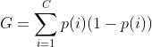

# CART Decision Tree

## Basics
A Classification and Regression Tree, or a CART, is a type of Decision Tree algorithm that is used for classification and regression for predictive modeling problems.

The CART algorithm will be used to calculate the probability our classification may be incorrect. As shown in DecisionTreeShapes.py, the algorithm asks questions relevant to the dataset in order to calculate the possibility of incorrect classification (i.e. colour == ‘Red’?, shape == ‘Circle’?). As a symptom checker, each time a symptom is selected by a user, the algorithm will narrow down which diseases associated with the symptoms may be the correct diagnoses. As more symptoms are inputted, the gini impurity will become smaller each time. Once the user has finished inputting symptoms, there will be two lists containing possible diseases as well as improbable diseases. The improbable diseases will be discarded, and the possible diseases will be sifted through using the Bayesian algorithm in order to correctly predict a diagnosis. 

## DecisionTreeShapes.py Code Break Down
**Data Set**

```
trainingData = [['Red', 'Square'], ['Blue', 'Square'], ['Green', 'Circle'], ...]
header = ["colour", "shape"]
```
The dataset for this program consists of two columns and 15 rows. Each element within the dataset consists of a colour and a shape. The data points alternate between Red, Blue, and Green Circles and Squares.

**Class Question**

This class is used to partition the given dataset. Based on a column number and a column value, a question containing a condition is generated. For example, a question asked can be 'shape == 'Circle'?', or 'colour == 'Blue'?'.

**Gini Impurity, Gini Formula**

These two functions are used to calculate the Gini Impurity. This measurment is the probability of classifying a random data point in the data set incorrectly. The data point is randomly classified based on the distribution class labels in the dataset (in *DecisionTreeShapes.py*, these labels are defined in ```header = ["colour", "shape"]```). 
```def giniFormula``` calls ```def giniImpurity``` to calculate the Gini Impurity, then the following formula is calculated:



**Best Split**

This recursive function generates the best information gain from the calculated Gini Formula, as well as the next best question to ask. It determines which rows contain information that satisfy and do not satisfy the question asked. The satisfactory and non-satisfactory rows are saved in their corresponding lists. Next, the two lists, as well as the calculated Gini Impurity are sent to the '''giniFormula''' function to recalculate. 


